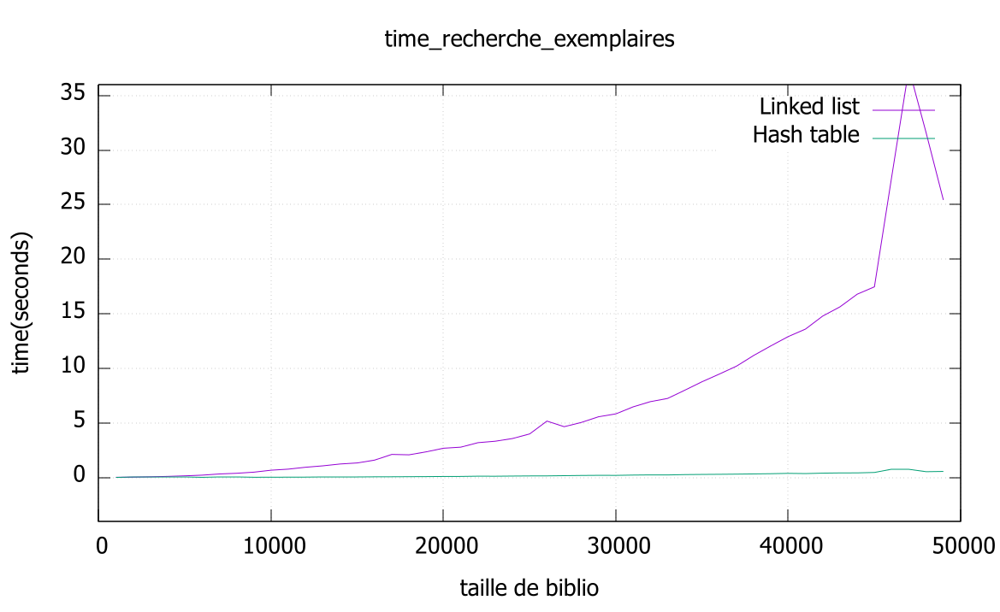

# Comparaison des deux structures

Les deux structures de données ont un temps d'exécution similaire pour la recherche basée sur le `num` et sur le `titre` car la table de hachage est indexée seulement par le nom de l'auteur.

Nous avons volontairement laisser le nombre de donnée inférieur à 0,75 fois la longueur de la table de hachage afin de minimiser les conflits sans gaspiller d'espace.

Concernant les fonctions `recherche_exemplaires` des deux structures, nous obtenons des résultats flagrants.

On s'aperçoit donc qu'à un certain seuil, les listes chaînées ne deviennent pas une bonne solution pour effectuer des recherches et deviennent donc très conséquentes en temps de calcul.

On en déduit que la table de hachage est beaucoup plus performante et permet donc un accès plus rapide, le temps d'accès dans le pire des cas peut être de O(n). 
